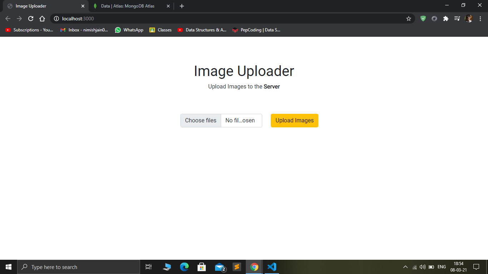
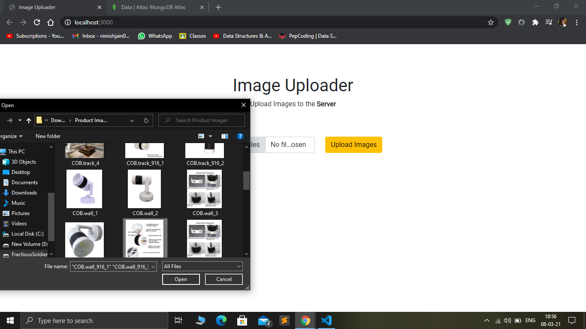
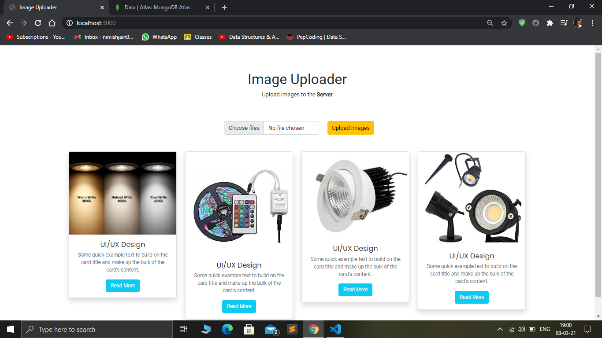
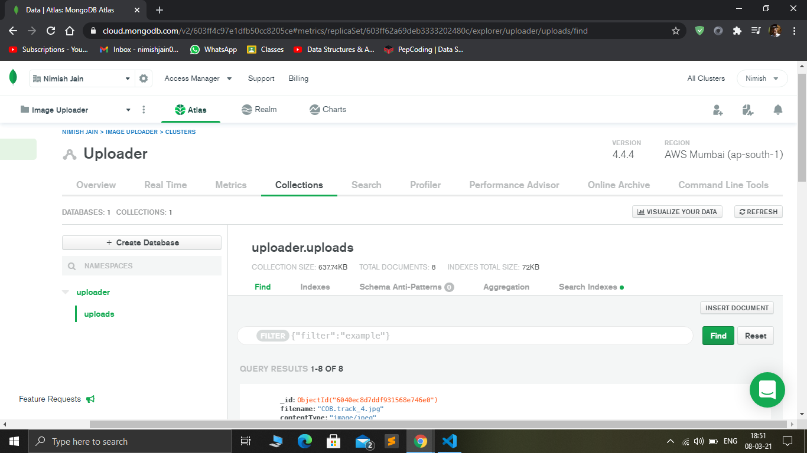
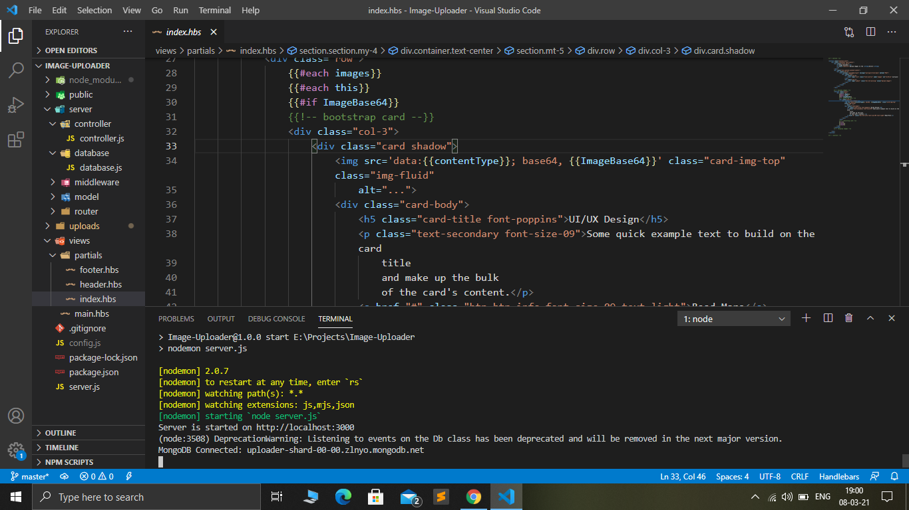

# ImageUploader

This is an app created using **NodeJS, ExpressJS** & **MongoDB**. This has a basic functionality of uploading multiple images to the server at once.
We can select as many as 12 images at once and upload directly to cloud. This has been done using **MulterJS**. The dynamic rendering of contents is done by **Handlebars view engine**.
The Database used here is **MongoDB Atlas**, connection to which has been established using **Mongoose**. 

## Tech Stack

1. NodeJS
2. ExpressJS
3. Handlebars View Engine
4. MulterJS
5. MongoDB Atlas
6. Mongoose
7. Bootsrap

Here are some Screenshots from the project

